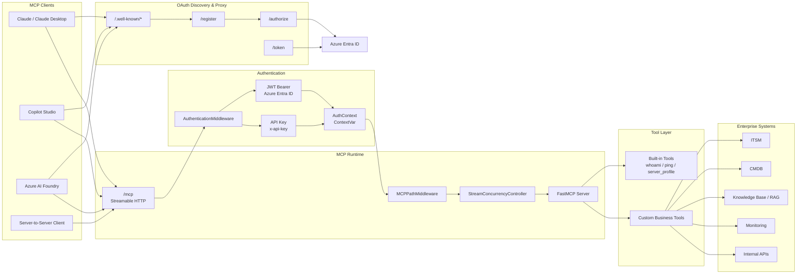

# Production-Ready MCP Server Boilerplate

An opinionated Python template for publishing Model Context Protocol (MCP) servers with real-world authentication, HTTP transport, health checks, Docker packaging, and client setup notes.

This project is designed for builders who want to move beyond a local demo and ship an MCP server that can connect to tools such as Claude, Copilot Studio, Azure AI Foundry, and server-to-server clients.

## Why This Exists

Most MCP examples are intentionally tiny. That is great for learning the protocol, but less helpful when you need to expose a server over HTTP, support OAuth discovery, keep API-key access for automation, and explain the deployment shape to another engineer.

This boilerplate packages those practical pieces into a small, readable template:

- FastMCP tool definitions with FastAPI HTTP hosting
- OAuth 2.0 resource server flow for Azure Entra ID
- API key authentication for local development and automation
- OAuth discovery endpoints for MCP-capable clients
- Streamable HTTP mounting with path normalization
- Health and runtime metrics endpoint
- Docker and Compose support
- Integration docs with screenshots for popular clients
- Tests and GitHub Actions CI so forks start with a quality bar

## Repository Layout

```text
.
├── template/                    # Copy this folder to start a new MCP server
│   ├── src/server.py             # MCP tools live here
│   ├── src/http/                 # FastAPI app, OAuth proxy, middleware
│   ├── tests/                    # Starter tests
│   ├── Dockerfile
│   ├── docker-compose.yml
│   └── pyproject.toml
├── docs/
│   ├── CLIENT_INTEGRATION.md     # Claude, Copilot Studio, Azure AI Foundry notes
│   ├── SYSTEM_DESIGN.md          # Design rationale and request flow
│   └── screenshots/              # Setup screenshots
└── README.md
```

## Quick Start

```bash
cd template
uv sync --extra dev
cp .env.example .env
python dev.py
```

Then check:

```bash
curl http://localhost:8080/health
curl http://localhost:8080/.well-known/oauth-protected-resource
```

For Docker:

```bash
cd template
cp .env.example .env
docker compose up --build
curl http://localhost:8080/health
```

## Configuration

| Variable | Required | Description |
|---|---:|---|
| `BASE_URL` | Yes | Public URL of this server, no trailing slash |
| `API_KEYS` | Yes | Comma-separated keys accepted by `x-api-key` auth |
| `SERVICE_NAME` | No | Display name returned by metadata endpoints |
| `SERVICE_OWNER` | No | Owner or organization name |
| `SERVICE_VERSION` | No | Version displayed by root, health, and tools |
| `AZURE_TENANT_ID` | OAuth | Azure Entra tenant ID |
| `AZURE_CLIENT_ID` | OAuth | Azure App Registration client ID |
| `AZURE_CLIENT_SECRET` | Optional | Server-side secret used by the OAuth proxy |

Set `BASE_URL=http://localhost:8080` and leave the Azure variables blank to run in API-key-only mode.

## Authentication Modes

| Scheme | Header | Best For |
|---|---|---|
| OAuth 2.0 with Azure Entra | `Authorization: Bearer {jwt}` | Claude.ai, Copilot Studio, enterprise users |
| API key | `x-api-key: {key}` | Local development, service jobs, simple private deployments |

Public paths are intentionally limited to `/`, `/health`, `/.well-known/*`, `/docs`, `/redoc`, `/openapi.json`, `/authorize`, `/token`, and `/register`.

## Included MCP Tools

| Tool | Description |
|---|---|
| `whoami` | Returns JWT claims when OAuth is used, or an API-key auth message |
| `ping` | Echoes a message with a UTC timestamp |
| `server_profile` | Returns service metadata, auth mode, endpoints, and extension hints |

## Client Integration

Use this MCP endpoint:

```text
https://your-host.com/mcp
```

OAuth endpoints are discovered through:

- `/.well-known/oauth-protected-resource`
- `/.well-known/oauth-authorization-server`

For Claude and Azure client walkthroughs, see [docs/CLIENT_INTEGRATION.md](docs/CLIENT_INTEGRATION.md). For design decisions, see [docs/SYSTEM_DESIGN.md](docs/SYSTEM_DESIGN.md).

## Add Your Own Tool

Edit `template/src/server.py`:

```python
@mcp.tool()
async def my_tool(param: str) -> dict:
    """Tool description shown to the LLM."""
    auth = get_auth()
    return {
        "input": param,
        "auth_type": auth.auth_type if auth else "unknown",
    }
```

`get_auth()` returns an `AuthContext` with:

- `auth_type`: `"bearer"` or `"api_key"`
- `user_oid`, `user_name`, `user_upn`: populated for OAuth bearer tokens

## Development Checks

```bash
cd template
uv sync --extra dev
uv run pytest
```

The GitHub Actions workflow runs the same test command on every push and pull request.

## Architecture

This boilerplate is organized around a small but production-oriented request path: public OAuth discovery, authentication middleware, FastMCP streamable HTTP transport, and extensible tool handlers.



## Roadmap Ideas

- Add deployment guides for Azure Container Apps, Fly.io, or Render
- Add optional OpenTelemetry tracing
- Add a cookiecutter-style project generator
- Add more client compatibility tests
- Add example business tools, such as CRM lookup or internal search

## License

MIT. Use it, fork it, and adapt it for your own MCP projects.
