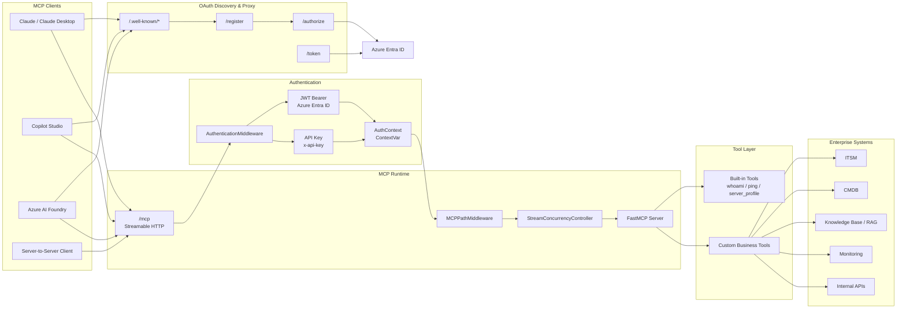

# Practical MCP Server Boilerplate for Azure Entra Integration

A compact, domain-neutral Python template for experimenting with Model Context Protocol (MCP) servers that use FastAPI, FastMCP, Azure Entra ID integration, API-key fallback, health checks, Docker packaging, and client setup notes.

This project is designed for builders who want a small, readable starting point for moving beyond a local MCP demo while still being able to replace the sample tools with their own business or IT workflows.

## Why This Exists

Most MCP examples are intentionally tiny. That is great for learning the protocol, but less helpful when you need to expose a server over HTTP, support OAuth discovery, keep API-key access for automation, and explain the deployment shape to another engineer.

Microsoft also provides more complete Azure-hosted MCP samples. This repository takes a narrower approach: it is a lightweight boilerplate meant to be easy to read, fork, and adapt.

This boilerplate packages those practical pieces into a small template:

- FastMCP tool definitions with FastAPI HTTP hosting
- Azure Entra ID integration through a lightweight OAuth proxy
- API key authentication for local development and automation
- OAuth discovery endpoints for MCP-capable clients
- Streamable HTTP mounting with path normalization
- Health and runtime metrics endpoint
- Docker and Compose support
- Integration docs with screenshots for popular clients
- Tests and GitHub Actions CI so forks start with a quality bar

## How This Differs from Azure's Official Sample

Microsoft provides [Azure-Samples/remote-mcp-webapp-python-auth-oauth](https://github.com/Azure-Samples/remote-mcp-webapp-python-auth-oauth), a full FastAPI MCP Weather Server sample with OAuth 2.1, PKCE, Dynamic Client Registration, Azure AD integration, a web test interface, and Azure App Service deployment through `azd`.

This repository is intentionally smaller and more domain-neutral. It is not trying to replace the Azure sample. Instead, it focuses on a reusable boilerplate shape:

| Area | Azure official sample | This repository |
|---|---|---|
| Primary goal | Full Azure-hosted sample application | Compact boilerplate / starter template |
| Domain | Weather tools | Domain-neutral starter tools |
| Deployment focus | Azure App Service with `azd` | Local-first Docker / Compose, adaptable deployment shape |
| Auth focus | Full OAuth 2.1 sample flow with PKCE and DCR | Azure Entra OAuth proxy bridge plus resource-server request validation |
| Tooling | Built-in web OAuth test interface | Minimal runtime with system design and client integration notes |
| Best for | Learning and deploying the official Azure sample app | Forking into your own MCP server PoC or business-tool template |

## Azure Entra ID and OAuth Proxy Scope

The official MCP SDK examples are the best place to learn the core protocol mechanics, including OAuth flows, protected resource metadata, client registration, and token validation patterns.

This boilerplate has a narrower practical focus: integrating an MCP server with Azure Entra ID while keeping the server easy to run, package, and extend.

Some MCP-capable clients expect OAuth discovery and Dynamic Client Registration-style endpoints, while Azure Entra uses a static App Registration model. To bridge that gap, this project includes a lightweight OAuth proxy layer:

- `/.well-known/oauth-protected-resource` and `/.well-known/oauth-authorization-server` expose MCP-compatible discovery metadata
- `/register` accepts client registration requests from MCP clients and maps them to the configured Azure App Registration
- `/authorize` forwards the authorization request to Azure Entra ID with the expected scopes
- `/token` exchanges authorization codes through Azure Entra ID and returns the resulting tokens to the client

The MCP server still validates incoming requests as a resource server: bearer tokens are verified as Azure Entra JWTs, and API keys remain available for local development, automation, or simple private deployments.

### Claude.ai DCR Compatibility Note

As of 2026-05-13, Anthropic's public documentation and support materials indicate that remote MCP usage has two related but different patterns:

- Claude.ai custom connectors can use OAuth-based remote MCP servers and support Dynamic Client Registration-style flows.
- Anthropic's Messages API MCP connector can accept an `authorization_token` supplied by the API caller after the caller obtains a token through its own OAuth flow.

This distinction matters for this project. The `/register`, `/authorize`, and `/token` routes are primarily included for MCP clients such as Claude.ai custom connectors that discover OAuth metadata and expect an MCP-compatible registration and authorization surface.

Azure Entra ID does not dynamically create a new App Registration for every MCP client. This project therefore maps the client-facing DCR-style flow to a preconfigured Azure App Registration:

- `/register` returns a synthetic client registration to the MCP client
- `/authorize` maps that synthetic client to the configured Azure Entra App Registration and redirects the user to Azure Entra ID
- `/token` proxies the authorization-code exchange to Azure Entra ID
- `/mcp` remains the protected MCP resource endpoint and validates the resulting bearer token

In other words, this project does not replace Azure Entra ID. It provides the MCP-facing OAuth compatibility layer that some clients expect, while delegating identity and token issuance to Azure Entra ID.

## Repository Layout

```text
.
├── template/                    # Copy this folder to start a new MCP server
│   ├── src/server.py             # MCP tools live here
│   ├── src/http/                 # FastAPI app, OAuth proxy, middleware
│   ├── tests/                    # Starter tests
│   ├── Dockerfile
│   ├── docker-compose.yml
│   └── pyproject.toml
├── docs/
│   ├── CLIENT_INTEGRATION.md     # Claude, Copilot Studio, Azure AI Foundry notes
│   ├── SYSTEM_DESIGN.md          # Design rationale and request flow
│   └── screenshots/              # Setup screenshots
└── README.md
```

## Quick Start

```bash
cd template
uv sync --extra dev
cp .env.example .env
python dev.py
```

Then check:

```bash
curl http://localhost:8080/health
curl http://localhost:8080/.well-known/oauth-protected-resource
```

For Docker:

```bash
cd template
cp .env.example .env
docker compose up --build
curl http://localhost:8080/health
```

## Configuration

| Variable | Required | Description |
|---|---:|---|
| `BASE_URL` | Yes | Public URL of this server, no trailing slash |
| `API_KEYS` | Yes | Comma-separated keys accepted by `x-api-key` auth |
| `SERVICE_NAME` | No | Display name returned by metadata endpoints |
| `SERVICE_OWNER` | No | Owner or organization name |
| `SERVICE_VERSION` | No | Version displayed by root, health, and tools |
| `AZURE_TENANT_ID` | OAuth | Azure Entra tenant ID |
| `AZURE_CLIENT_ID` | OAuth | Azure App Registration client ID |
| `AZURE_CLIENT_SECRET` | Optional | Server-side secret used by the OAuth proxy |

Set `BASE_URL=http://localhost:8080` and leave the Azure variables blank to run in API-key-only mode.

## Authentication Modes

| Scheme | Header | Best For |
|---|---|---|
| OAuth 2.0 with Azure Entra | `Authorization: Bearer {jwt}` | Claude.ai, Copilot Studio, enterprise users |
| API key | `x-api-key: {key}` | Local development, service jobs, simple private deployments |

Public paths are intentionally limited to `/`, `/health`, `/.well-known/*`, `/docs`, `/redoc`, `/openapi.json`, `/authorize`, `/token`, and `/register`.

## Included MCP Tools

| Tool | Description |
|---|---|
| `whoami` | Returns JWT claims when OAuth is used, or an API-key auth message |
| `ping` | Echoes a message with a UTC timestamp |
| `server_profile` | Returns service metadata, auth mode, endpoints, and extension hints |

## Client Integration

Use this MCP endpoint:

```text
https://your-host.com/mcp
```

OAuth endpoints are discovered through:

- `/.well-known/oauth-protected-resource`
- `/.well-known/oauth-authorization-server`

For Claude and Azure client walkthroughs, see [docs/CLIENT_INTEGRATION.md](docs/CLIENT_INTEGRATION.md). For design decisions, see [docs/SYSTEM_DESIGN.md](docs/SYSTEM_DESIGN.md).

## Add Your Own Tool

Edit `template/src/server.py`:

```python
@mcp.tool()
async def my_tool(param: str) -> dict:
    """Tool description shown to the LLM."""
    auth = get_auth()
    return {
        "input": param,
        "auth_type": auth.auth_type if auth else "unknown",
    }
```

`get_auth()` returns an `AuthContext` with:

- `auth_type`: `"bearer"` or `"api_key"`
- `user_oid`, `user_name`, `user_upn`: populated for OAuth bearer tokens

## Development Checks

```bash
cd template
uv sync --extra dev
uv run pytest
```

The GitHub Actions workflow runs the same test command on every push and pull request.

## Architecture

This boilerplate is organized around a small but practical request path: public OAuth discovery, authentication middleware, FastMCP streamable HTTP transport, and extensible tool handlers.



## Roadmap Ideas

- Add deployment guides for Azure Container Apps, Fly.io, or Render
- Add optional OpenTelemetry tracing
- Add a cookiecutter-style project generator
- Add more client compatibility tests
- Add example business tools, such as CRM lookup or internal search

## License

MIT. Use it, fork it, and adapt it for your own MCP projects.
