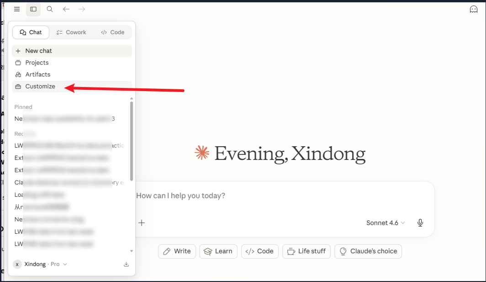
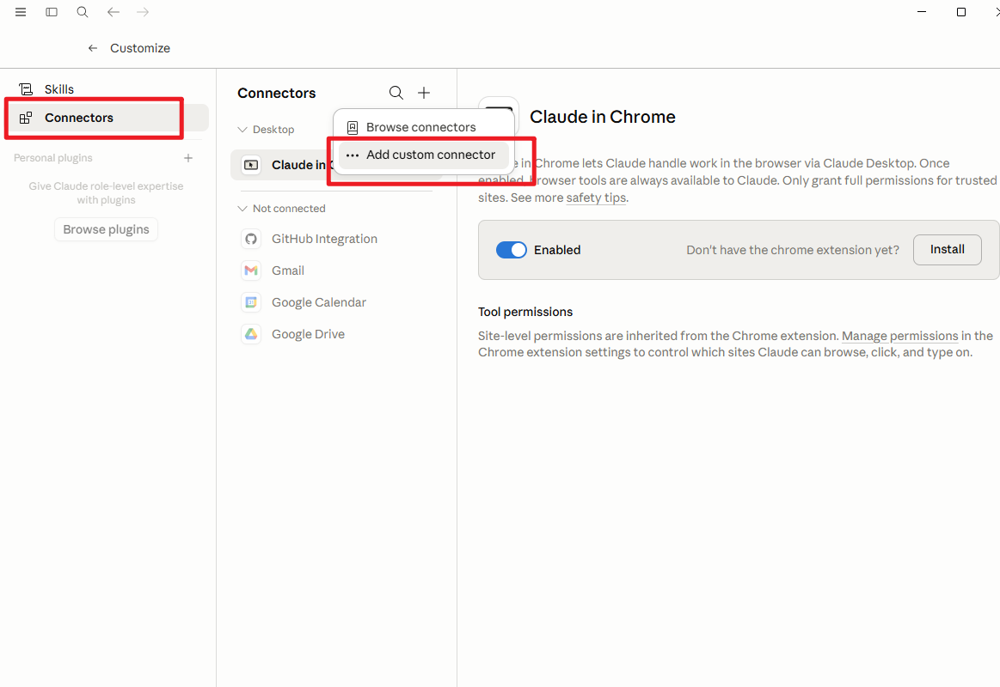
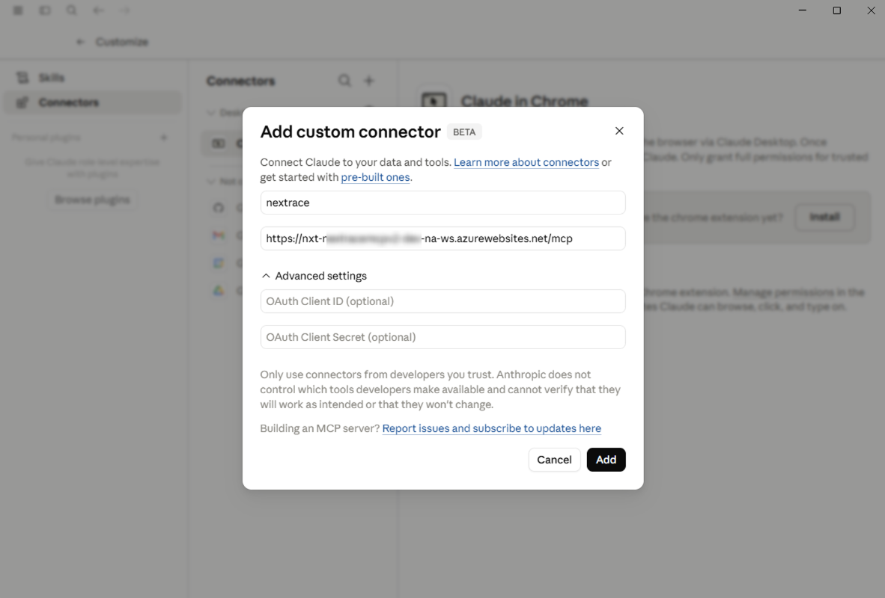
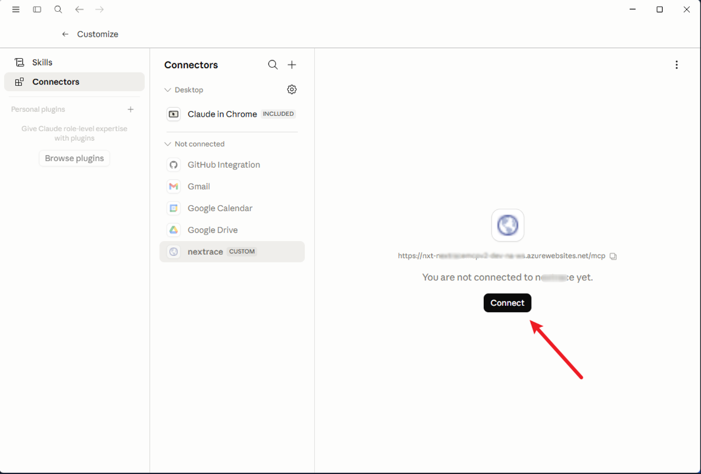
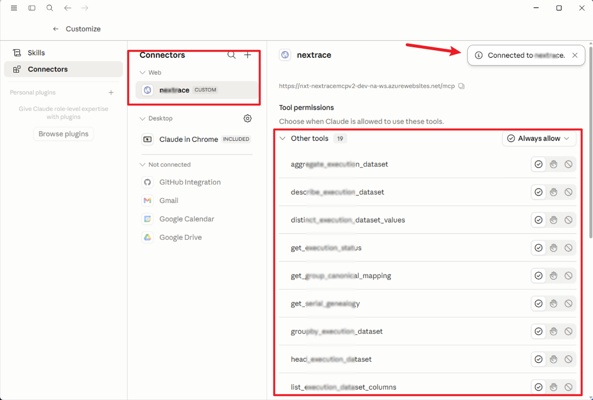
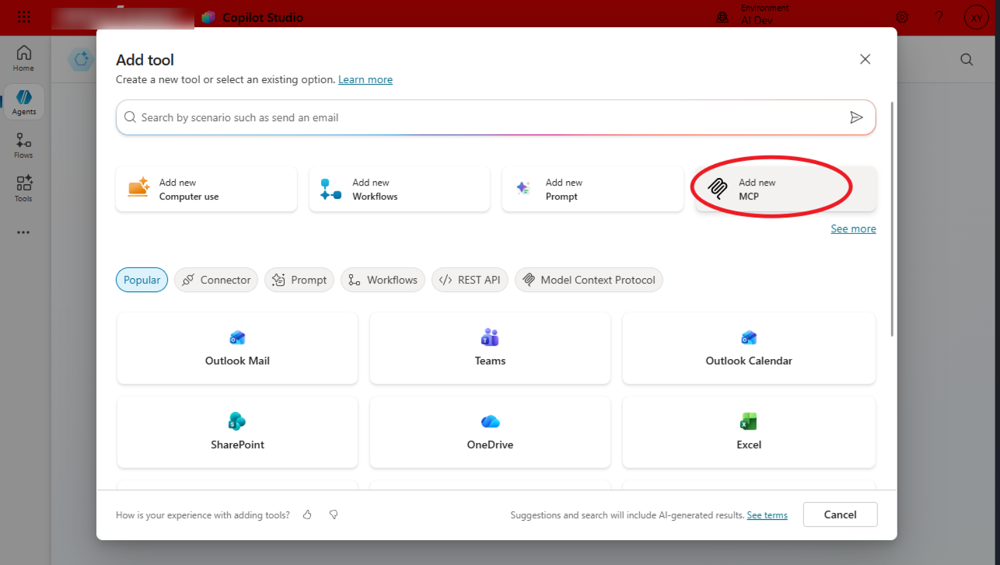
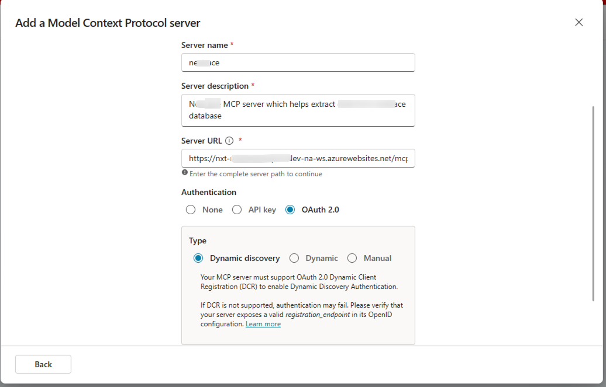
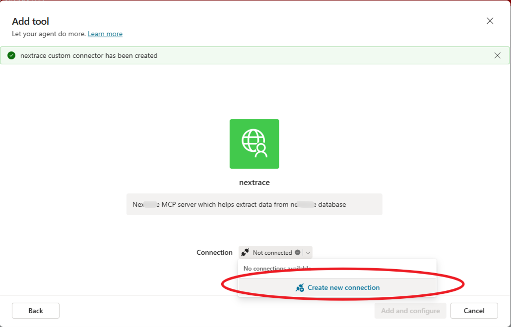
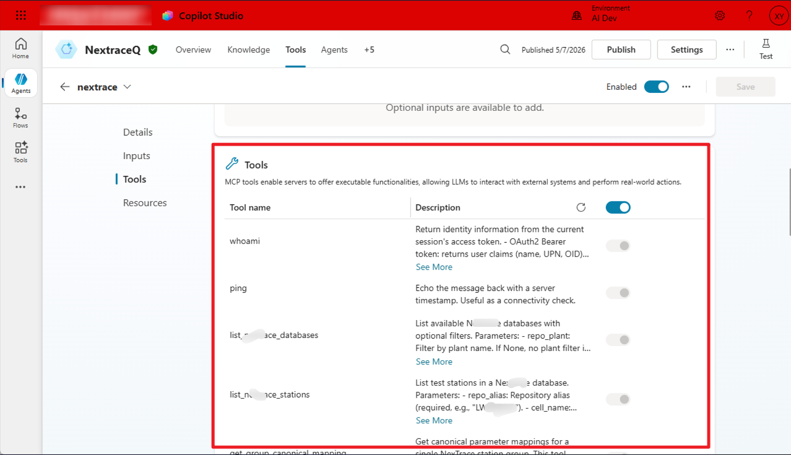
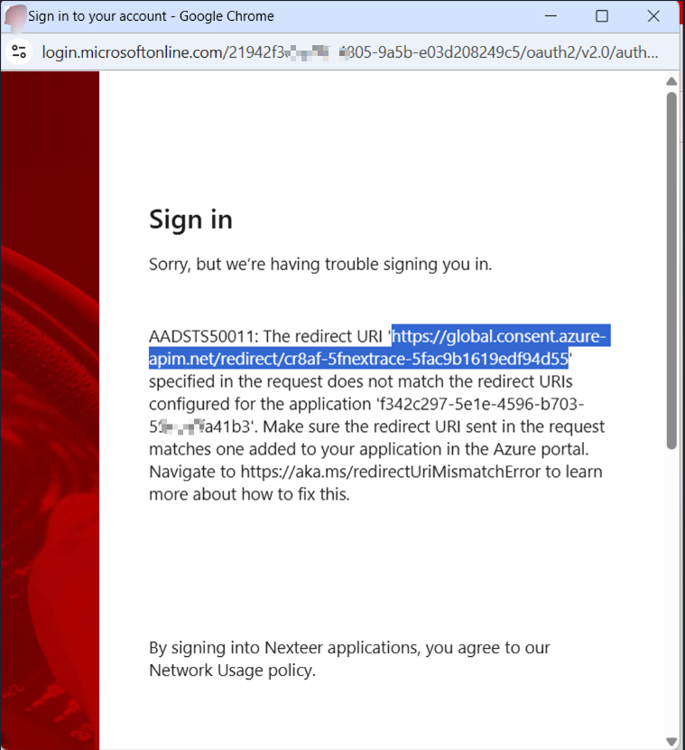

# Client Integration Guide

This guide explains how different types of clients can connect to this MCP server.

---

## Overview

The server supports two authentication schemes:

| Scheme | Use Case |
|---|---|
| **OAuth 2.0 (Azure Entra)** | Claude.ai users, Copilot Studio, programmatic clients |
| **API Key** | Server-to-server, scripts, local dev |

---

## Part 1: Azure App Registration Setup For Your MCP Server

Do this once before connecting any OAuth2 client.

### 1.1 Create or open the App Registration

In [Azure Portal](https://portal.azure.com) → **Microsoft Entra ID → App registrations → New registration**:


### 1.2 Configure Redirect URIs

In the App Registration → **Authentication → Add a platform**:

Add all of the following:
- `https://claude.ai/api/mcp/auth_callback` — Claude.ai 
- `https://chatgpt.com/connector_platform_oauth_redirect` — ChatGPT
- `https://global.consent.azure-apim.net/redirect/{your-connector-id}` — Copilot Studio (see note below)


> **Copilot Studio redirect URI:** the `{connector-id}` portion is generated when you create the connector and is unique per connection. When the Copilot Studio authorization page first opens, copy the exact `redirect_uri` value from the browser URL bar and add it here. You may need to add it, save, then retry the connection.

### 1.3 Configure token authentication for the proxy

The server's `/token` proxy exchanges authorization codes with Entra on behalf of clients. 

**Confidential client with secret:**

1. In the App Registration → **Certificates & secrets → New client secret**
2. Copy the secret value into the server's environment:
   ```
   AZURE_CLIENT_SECRET=<your secret>
   ```
### 1.4 Expose an API scope

In **Expose an API**:

1. Set **Application ID URI** to `api://{AZURE_CLIENT_ID}` (click Save)
2. Click **Add a scope**:
   - **Scope name:** `access_as_user`
   - **Who can consent:** Admins and users
   - **Admin consent display name:** `Access MCP server as user`
   - Click **Add scope**

The full scope string will be: `api://{AZURE_CLIENT_ID}/access_as_user`

---

## Part 2: Connecting Claude.ai / Claude Desktop 
Any user in your Azure AD tenant can connect to this server via Claude.ai (web) or Claude Desktop. Every user follows the same steps and uses the **same** `AZURE_CLIENT_ID` as optional — do **not** create a separate App Registration per user.

### Steps (same for every user)

1. Open Claude.ai (web or desktop) (**Customizes → Connectors → Add custom connector**) 

  
   
   

2. Fill in:
   - **MCP URL:** `https://your-host.com/mcp`
   - **Auth type:** OAuth 2.0
   - **Client ID:** the server's `AZURE_CLIENT_ID` (optional — same value for MCP server)
   - **Client Secret:** leave blank, not required

   
    


4. Click **Connect** — you will be redirected to Microsoft login
 
    

5. Sign in with **your own** Azure AD account and grant consent

Each user signs in as themselves; the resulting JWT contains their individual identity (`oid`, `name`, `upn`). The shared App Registration just governs which tenant and scopes are allowed.

> **Note:** The Client ID field accepts any value — the proxy always replaces it with the server's `AZURE_CLIENT_ID` before forwarding to Entra. Leaving it blank triggers DCR (automatic registration). The Client Secret field in the connector UI should always be left blank; the server's `AZURE_CLIENT_SECRET` is an internal env var and is never entered here.

6. Verify your server connected
 
    


### How it works

```
Claude.ai
  → POST /register          (DCR — server issues a synthetic client_id)
  → GET  /authorize         (proxy ignores incoming client_id, uses AZURE_CLIENT_ID → Entra)
  → Microsoft login page    (each user signs in as themselves)
  → Entra redirects back to claude.ai/api/mcp/auth_callback with code
  → POST /token             (proxy uses AZURE_CLIENT_ID + PKCE to exchange code)
  → Entra returns JWT       (aud = api://{AZURE_CLIENT_ID}, sub/oid = this specific user)
  → Claude sends JWT in Authorization: Bearer header on every MCP request
  → AuthMiddleware validates JWT and extracts user's oid/name/upn
```

OAuth discovery is automatic — Claude reads `/.well-known/oauth-protected-resource` and `/.well-known/oauth-authorization-server` to find all endpoint URLs.

---

## Part 3: Connecting Copilot Studio

Copilot Studio connects via **Dynamic Discovery** — the same DCR proxy flow used by Claude.ai. No separate App Registration is needed.

### Steps

1. In Copilot Studio, add a new MCP connector as tool to your agent

    

   Fill in:
   
   - **Server Name:** Name of your MCP server
   - **Server Description:** Descriptioin of your server 
   - **Server URL:** `https://your-host.com/mcp`
 
    
 
    
 
    


2. When prompted _"Your MCP server must support OAuth 2.0 Dynamic Client Registration to enable Dynamic Discovery Authentication"_, click **Continue**

3. Copilot Studio will open the authorization page. **Before completing login**, copy the exact `redirect_uri` value from the popout — it looks like:
   ```
   https://global.consent.azure-apim.net/redirect/{connector-id} 
   ```

    

4. In Azure Portal → App Registration → **Authentication → Web platform**, add that URI and save

5. Return to Copilot Studio and complete the Azure login

### How it works

```
Copilot Studio
  → POST /register          (DCR — server issues a synthetic client_id)
  → GET  /authorize         (no scope sent — proxy injects api:// scope automatically)
  → Microsoft login page
  → Entra redirects to global.consent.azure-apim.net with code
  → POST /token             (proxy exchanges code using AZURE_CLIENT_ID + secret)
  → Entra returns JWT
  → Copilot Studio sends JWT on every MCP request
```

---

## Part 4: Connecting Programmatic / Server-to-Server Clients

This applies to backend agents and services (e.g. Semantic Kernel, LangChain, custom scripts) that call the MCP server without a human user in the loop.

> **Important:** `access_as_user` is a *delegated* permission — it requires a real user to sign in. Backend services have no user, so they use the **Client Credentials Flow** (application identity) with a different permission type and scope. The two flows are not interchangeable.

### Option A — API Key (recommended for most backend use cases)

Zero Azure configuration needed. Just set `API_KEYS` in the server environment and pass the key in requests.

```python
# Semantic Kernel (pip install semantic-kernel[mcp])
from semantic_kernel import Kernel
from semantic_kernel.connectors.mcp import MCPStreamableHttpPlugin

kernel = Kernel()
async with MCPStreamableHttpPlugin(
    name="my_mcp_server",
    url="https://your-host.com/mcp",
    headers={"x-api-key": "your-api-key"},
) as plugin:
    kernel.add_plugin(plugin)
    # invoke tools within this block
    result = await kernel.invoke(plugin["my_tool"])
```

```python
# Plain MCP SDK
from mcp import ClientSession
from mcp.client.streamable_http import streamablehttp_client

async with streamablehttp_client(
    "https://your-host.com/mcp",
    headers={"x-api-key": "your-api-key"},
) as (read, write, _):
    async with ClientSession(read, write) as session:
        await session.initialize()
        result = await session.call_tool("my_tool", {})
```

In MCP tools: `get_auth()` returns `auth_type = "api_key"`, `user_oid = None`.

---

### Option B — Client Credentials OAuth (when a Bearer token is required)

Backend services use the **Client Credentials Flow** — the service authenticates as itself (its service principal), not as a user. No proxy is involved; the client calls Entra directly.

#### Azure setup (one-time)

1. **Create a new App Registration** for the client service (separate from the server's)

2. On the **MCP server's** App Registration → **Expose an API → App roles → Create app role**:
   - **Display name:** `MCP Caller`
   - **Allowed member types:** Applications
   - **Value:** `mcp.call`
   - Enable the role → Save

3. On the **client's** App Registration → **API permissions → Add a permission**:
   - Choose **My APIs** → select the MCP server's App Registration
   - Choose **Application permissions** (not Delegated) → check `mcp.call`
   - Click **Grant admin consent**

4. Create a **client secret** on the client App Registration → **Certificates & secrets**

#### Code

```python
# pip install azure-identity mcp semantic-kernel

# **Example code for reference only**

from azure.identity.aio import ClientSecretCredential
from semantic_kernel import Kernel
from semantic_kernel.connectors.mcp import MCPStreamableHttpPlugin

TENANT_ID            = "<your-tenant-id>"
SK_CLIENT_ID         = "<sk-agent-app-registration-id>"
SK_CLIENT_SECRET     = "<sk-agent-client-secret>"
MCP_SERVER_CLIENT_ID = "<mcp-server-azure-client-id>"

async def get_token() -> str:
    credential = ClientSecretCredential(
        tenant_id=TENANT_ID,
        client_id=SK_CLIENT_ID,
        client_secret=SK_CLIENT_SECRET,
    )
    # .default requests all application permissions granted to this client
    # Use api://{MCP_SERVER_CLIENT_ID}/.default — NOT access_as_user
    token = await credential.get_token(
        f"api://{MCP_SERVER_CLIENT_ID}/.default"
    )
    await credential.close()
    return token.token

async def run_agent():
    token = await get_token()
    kernel = Kernel()
    async with MCPStreamableHttpPlugin(
        name="my_mcp_server",
        url="https://your-host.com/mcp",
        headers={"Authorization": f"Bearer {token}"},
    ) as plugin:
        kernel.add_plugin(plugin)
        # invoke tools within this block
        result = await kernel.invoke(plugin["my_tool"])
```

> **Token renewal:** tokens expire (typically 1 hour). `ClientSecretCredential` caches and auto-refreshes when you call `get_token()` again — call it before each MCP session rather than storing the token string long-term.

#### What the server sees

```python
auth = get_auth()
auth.auth_type  # "bearer"
auth.user_oid   # service principal OID (not a human user)
auth.user_name  # None
auth.user_upn   # None
```

---

## Part 5: API Key Clients

For server-to-server calls, scripts, or local dev — no Azure setup needed.

1. Add one or more keys to `.env`:
   ```
   API_KEYS=key-one,key-two,key-three
   ```

2. Send the key in every request:
   ```http
   GET /mcp HTTP/1.1
   x-api-key: key-one
   ```

   Or as a query parameter:
   ```
   GET /mcp?api_key=key-one
   ```

API key requests are authenticated but carry no user identity. MCP tools receive an `AuthContext` with `auth_type = "api_key"` and `user_oid = None`.

---

## Part 6: Running Without OAuth2

Set `BASE_URL=http://localhost:8080` and leave the Azure vars blank:

```env
BASE_URL=http://localhost:8080
API_KEYS=dev-key
AZURE_TENANT_ID=
AZURE_CLIENT_ID=
```

The server starts in API-key-only mode. The `/.well-known/oauth-authorization-server` endpoint will return empty issuer/endpoint values, and the OAuth proxy routes (`/register`, `/authorize`, `/token`) remain mounted but non-functional without valid Azure credentials.

---

## Troubleshooting

| Error | Client | Cause | Fix |
|---|---|---|---|
| `AADSTS9010010` | Any | `resource` param sent to v2 token endpoint | Already handled in proxy — update to latest server code |
| `AADSTS7000218` | Any | Client secret required but not provided | Set `AZURE_CLIENT_SECRET` in server env, or enable "Allow public client flows" |
| `AADSTS50011` | Copilot Studio | Redirect URI not registered | Copy exact `redirect_uri` from browser URL bar and add to App Registration → Authentication → Web platform |
| "Authorization failed" | Claude.ai / Desktop | Wrong connector credentials | Leave Client Secret blank in connector UI; use server's `AZURE_CLIENT_ID` |
| `422 scope missing` | Copilot Studio | Older server version required `scope` | Update to latest server code (scope is now optional) |
| `401 Unauthorized` | Any | Missing or expired token | Re-authenticate; check token expiry |
| `403 Forbidden` | Any | Valid token but wrong audience | Token not issued for this server; check `aud` claim matches `api://{AZURE_CLIENT_ID}` |
| `504 Gateway Timeout` | Any | Entra token endpoint unreachable | Check network/firewall from server host |
